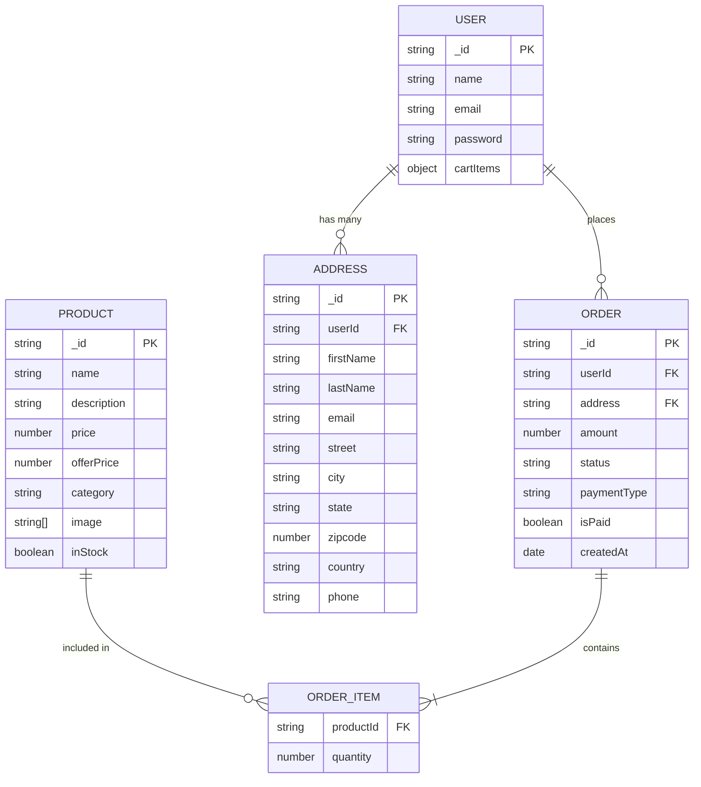

# Entity Relationship (ER) Diagram

```mermaid
erDiagram
    USER ||--o{ ORDER : places
    USER ||--o{ ADDRESS : "has many"
    USER {
        string _id PK
        string name
        string email
        string password
        object cartItems
    }
    PRODUCT ||--o{ ORDER_ITEM : "included in"
    PRODUCT {
        string _id PK
        string name
        string description
        number price
        number offerPrice
        string category
        string[] image
        boolean inStock
    }
    ORDER ||--|{ ORDER_ITEM : contains
    ORDER {
        string _id PK
        string userId FK
        string address FK
        number amount
        string status
        string paymentType
        boolean isPaid
        date createdAt
    }
    ORDER_ITEM {
        string productId FK
        number quantity
    }
    ADDRESS {
        string _id PK
        string userId FK
        string firstName
        string lastName
        string email
        string street
        string city
        string state
        number zipcode
        string country
        string phone
    }
```
