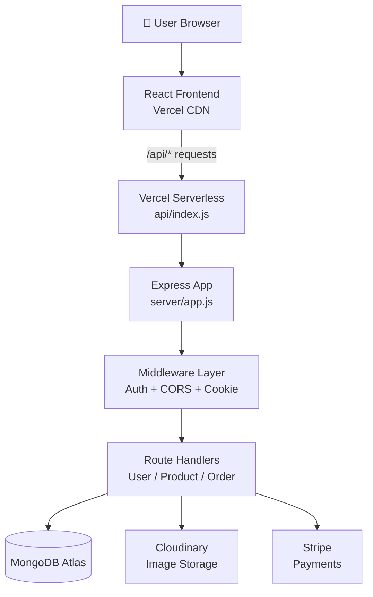
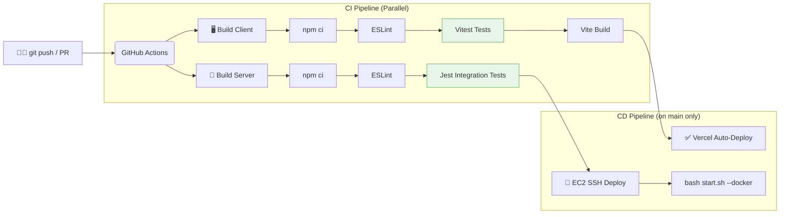

# BlueMart 🛒

> A premium full-stack grocery and snack delivery application with a complete DevOps pipeline.

**Built by Rahul Dhakad** | [Live Demo](https://blue-mart-drab.vercel.app)

---

## 🏗️ Architecture

BlueMart follows a **monorepo, 3-tier architecture** with complete separation of concerns:

```
BlueMart/
├── client/          # React + Vite Frontend (SPA)
├── server/          # Node.js + Express REST API
├── api/             # Vercel Serverless Entry Point
├── .github/
│   ├── workflows/   # GitHub Actions CI/CD Pipeline
│   └── dependabot.yml
└── start.sh         # Idempotent startup script
```



### Layer Breakdown

| Layer | Technology | Responsibility |
|---|---|---|
| **Frontend** | React 19, Vite, TailwindCSS v4 | UI rendering, state management, API calls |
| **API Gateway** | Vercel Serverless (`api/index.js`) | Routes `/api/*` to Express in production |
| **Backend** | Express 5, Node.js 22 | REST API, business logic, auth middleware |
| **Database** | MongoDB Atlas + Mongoose | Data persistence, schema validation |
| **Auth** | JWT + HttpOnly Cookies | Stateless, secure session management |
| **Media** | Cloudinary | Product image upload and CDN delivery |
| **Payments** | Stripe | Secure online payment processing |

---

## ⚙️ CI/CD Workflow

Every `git push` to `main` or Pull Request triggers the automated pipeline:



---

## 🧪 Testing Strategy

### Unit Tests (`Vitest` — Frontend)
Located in `client/src/**/*.test.jsx`:

| Test File | What it Tests |
|---|---|
| `MainBanner.test.jsx` | Hero section heading and CTA buttons render |
| `ProductCard.test.jsx` | Product name, price, ADD button, category badge |
| `Categories.test.jsx` | All category items render, VIEW ALL button present |
| `AppContext.test.js` | `getCartCount()` and `getCartAmount()` logic |

### Integration Tests (`Jest` — Backend)
Located in `server/tests/`:

| Test File | What it Tests |
|---|---|
| `api.integration.test.js` | Health check, product listing, user registration, auth guard |

Integration tests use **`mongodb-memory-server`** — a real in-memory MongoDB instance that requires no external connection. This ensures tests are **isolated, repeatable, and run anywhere**.

Run all tests:
```bash
# Frontend
cd client && npm run test

# Backend
cd server && npm test
```

---

## 🔐 Security Design

- **JWT** tokens stored in **HttpOnly cookies** (not localStorage) — XSS proof
- **CORS** restricted to allow-listed origins in production
- **Seller access** restricted by email — only authorized sellers can list products
- **bcryptjs** password hashing with salt rounds

---

## 🚀 Getting Started

### Local Development

```bash
# Option 1: Auto-start everything (idempotent)
bash start.sh

# Option 2: Manual
cd server && npm start
cd client && npm run dev

# Option 3: Docker
bash start.sh --docker
```

### Environment Variables

Create `server/.env`:
```env
MONGODB_URI=your_mongodb_uri
JWT_SECRET=your_jwt_secret
SELLER_EMAIL=your_seller_email
SELLER_PASSWORD=your_seller_password
CLOUDINARY_CLOUD_NAME=your_cloudinary_name
CLOUDINARY_API_KEY=your_cloudinary_key
CLOUDINARY_API_SECRET=your_cloudinary_secret
```

---

## 📦 Idempotent Deployment Script

`start.sh` is designed to be **run multiple times safely**:

```bash
# ✅ Good: Only installs if node_modules is missing
install_if_needed() {
  if [ ! -d "node_modules" ]; then npm ci; fi
}

# ✅ Good: Kills old process on port before starting (no port conflicts)
lsof -ti:4000 | xargs kill -9 2>/dev/null || true
```

---

## 🤝 Dependabot

Automated weekly dependency updates for:
- `/client` — Frontend npm packages (labeled `frontend`)
- `/server` — Backend npm packages (labeled `backend`)
- `github-actions` — Monthly updates for workflow actions

---

## 🧩 Design Decisions & Challenges

### ① Monorepo on Vercel
**Challenge:** Vercel expects either a pure frontend or backend project, not a monorepo with both.  
**Decision:** Created `api/index.js` as a Vercel serverless bridge that imports the Express app. Added a root `vercel.json` to route `/api/*` to the serverless function and everything else to the React build.

### ② Database Connections in Serverless
**Challenge:** Serverless functions spin up fresh for each request — calling `mongoose.connect()` every time would exhaust connection pools.  
**Decision:** Added a `readyState >= 1` guard in `connectDB()` so the connection is reused across warm invocations.

### ③ JWT in Cookies vs. localStorage
**Decision:** HttpOnly cookies are used for storing JWTs to prevent XSS attacks. This also means the frontend doesn't need to manually attach tokens — the browser handles it automatically.

### ④ Image Storage
**Challenge:** Storing images as base64 in MongoDB caused performance issues and exceeded document size limits.  
**Decision:** Migrated all uploads to Cloudinary. Images are served via Cloudinary's CDN for fast, global delivery.

---

## 👨‍💻 Author

**Rahul Dhakad**  
Full-Stack Developer | React · Node.js · MongoDB · DevOps
