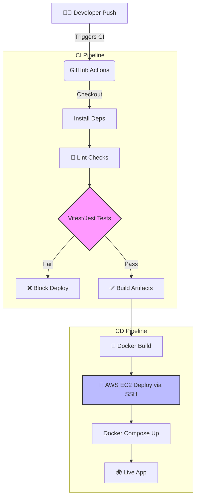

# BlueMart

A modern full-stack grocery and snack delivery application built by Rahul Dhakad.

---

## 🚀 Features

* Fresh groceries and snacks delivered to your door
* Seamless and fast shopping experience
* Secure payments integration
* Scalable full-stack architecture

---

## 🛠️ Tech Stack

* **Frontend:** React, Vite, TailwindCSS
* **Backend:** Node.js, Express, MongoDB
* **Payments:** Stripe
* **Media:** Cloudinary
* **DevOps:** Docker, GitHub Actions (CI/CD)

---

## ⚙️ DevOps Workflow Architecture



### Automation & Idempotency
- **Testing:** `mongodb-memory-server` ensures integration tests are perfectly isolated and run anywhere.
- **Startup script:** `start.sh` uses POSIX-compliant port termination (`lsof -ti`) for pristine idempotency.
- **Dependabot:** Fully configured weekly automation for NPM and Actions.

---

## ▶️ Getting Started

Run the project locally:

```bash
bash start.sh
```

---

## 🧪 Testing

* Unit testing using Jest
* Integration testing for API and backend
* (Optional) End-to-End testing using Cypress

---

## 📦 Deployment

* Dockerized application
* CI/CD pipeline using GitHub Actions
* Ready for deployment on AWS EC2

---

## 📚 Project Explanation

This project follows a CI/CD-based DevOps workflow where every code push triggers automated builds, lint checks, and tests. Docker is used for containerization, ensuring consistency across environments. The system is designed to be scalable, maintainable, and production-ready.

---

## 👨‍💻 Author

* Rahul Dhakad
