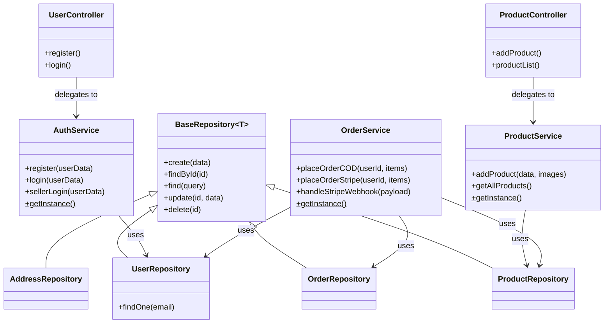

# Class Diagram - Clean Architecture

```mermaid
classDiagram
    class BaseRepository~T~ {
        +create(data)
        +findById(id)
        +find(query)
        +update(id, data)
        +delete(id)
    }

    class UserRepository {
        +findOne(email)
    }
    class ProductRepository
    class OrderRepository
    class AddressRepository

    BaseRepository <|-- UserRepository
    BaseRepository <|-- ProductRepository
    BaseRepository <|-- OrderRepository
    BaseRepository <|-- AddressRepository

    class AuthService {
        +register(userData)
        +login(userData)
        +sellerLogin(userData)
        +getInstance()$
    }
    class ProductService {
        +addProduct(data, images)
        +getAllProducts()
        +getInstance()$
    }
    class OrderService {
        +placeOrderCOD(userId, items)
        +placeOrderStripe(userId, items)
        +handleStripeWebhook(payload)
        +getInstance()$
    }

    AuthService --> UserRepository : uses
    ProductService --> ProductRepository : uses
    OrderService --> OrderRepository : uses
    OrderService --> ProductRepository : uses
    OrderService --> UserRepository : uses

    class UserController {
        +register()
        +login()
    }
    class ProductController {
        +addProduct()
        +productList()
    }

    UserController --> AuthService : delegates to
    ProductController --> ProductService : delegates to
```
