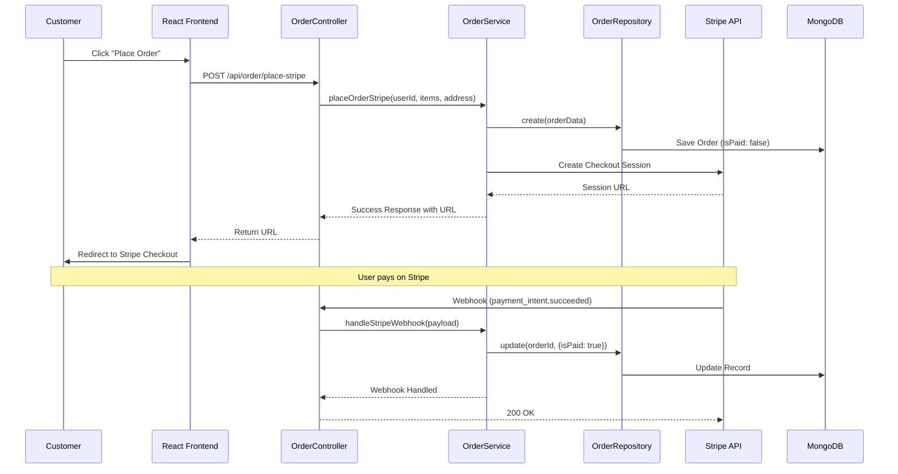

# Sequence Diagram - Checkout Flow

```mermaid
sequenceDiagram
    participant C as Customer
    participant FE as React Frontend
    participant CTR as OrderController
    participant SVC as OrderService
    participant REP as OrderRepository
    participant PG as Stripe API
    participant DB as MongoDB

    C->>FE: Click "Place Order"
    FE->>CTR: POST /api/order/place-stripe
    CTR->>SVC: placeOrderStripe(userId, items, address)
    SVC->>REP: create(orderData)
    REP->>DB: Save Order (isPaid: false)
    SVC->>PG: Create Checkout Session
    PG-->>SVC: Session URL
    SVC-->>CTR: Success Response with URL
    CTR-->>FE: Return URL
    FE->>C: Redirect to Stripe Checkout

    Note over C,PG: User pays on Stripe

    PG->>CTR: Webhook (payment_intent.succeeded)
    CTR->>SVC: handleStripeWebhook(payload)
    SVC->>REP: update(orderId, {isPaid: true})
    REP->>DB: Update Record
    SVC-->>CTR: Webhook Handled
    CTR-->>PG: 200 OK
```
